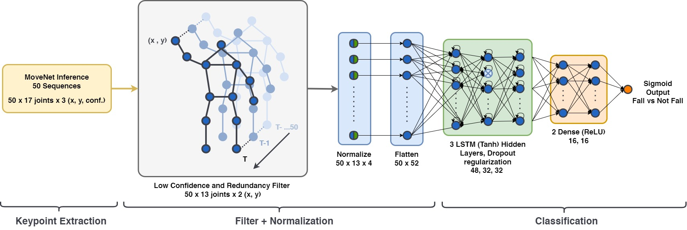
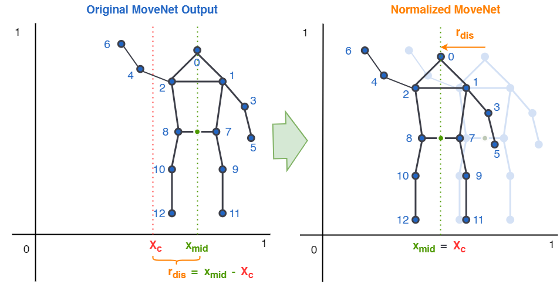
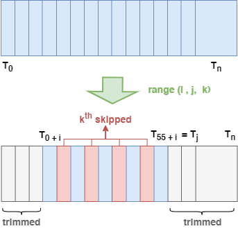

# Fall Detection From MoveNet Pose Estimation with OAK-D Hardware
LSTM based fall detection model with MoveNet pose estimation via OAK-D hardware and DepthAI.

(More work to be done)

## Demo

Note: This demo was trained with self-generated dataset. The current trained weights for demo.py uses UR Fall Detection Dataset and may not match in average precision. Inferencing was delayed by approx. 1 second due to high memory consumption from screen recording application (OBS).

## Pipeline
The pipeline is closely related to current HPE-based action recognition architectures. The fall detection pipeline utilizes the MoveNet skeletal-HPE, preprocesses the HPE data and passes the human pose inferences to an LSTM model that attempts to interpret 50 sequences of HPE joints (or “keypoints”) and distinguish fall and non-fall movements.

The HPE MoveNet model receives the RGB input frames from the edge camera device “OAK-D” by Luxonis and computes the output of the model using the device’s integrated processor. This approach fosters privacy through the black-box nature of edge processing and the absence of identity from the two-dimensional joint outputs of the model. The pipeline extracts 50 sequences of HPE inferences, each encompassing 17 unique HPE joint positions, holding temporal data that can be leveraged by the LSTM to determine a fall. 

 

Dataset: Self-generated using 50 fall, 50 non-fall movements.
Model Validation Dataset: UR Fall Detection Dataset

## Normalization
Normalisation algorithm involves moving the HPE skeleton to the centre of the frame to reduce bias inflicted by horizontal movements when training the LSTM network.


## Pre-Processing
UR Fall Detection Dataset contained inconsistent amount of frames, this needed to be shrinked to 55 frames to fit the network. The algorithm used to shrink to 55 frames involved finding a range (start, stop, step) for an iterator to scan through for an even spread of frames while keeping the length of 55 total frames.


This algorithm is found in extract_pose_data.py:
```py
# numFrames is an arbitrary number of frames (more than 55) that needs to be shrinked to 55.
# algorithm returns a tuple range which the length is always 55 with constant time complexity.

iter_range = ()
if numFrames == 55:
    iter_range = (1, 56,1)
else:
    step = numFrames // 55
    split = ((numFrames // step) - 55) // 2
    iter_range = (split, numFrames - (numFrames - 55 * step) + split, step)
```

This tuple range can then be used to ensure the HPE skeletal-inferencing is only performed on 55 frames of a data sample:
```py
for j in range(iter_range[0],iter_range[1],iter_range[2]):
    movenet.updateInputPath(file_path)
    frame, data, _ = movenet.getFrameInference() # Runs MoveNet HPE on image frame
    normalized = movenet.normalize(data) # Normalizes HPE data using above section's normalization method

    # After this, the program saves the data of the normalized + flattened MoveNet HPE Inferences to a 
    # numpy (.npy) file format for the LSTM network training
```

## Install
Install the python packages DepthAI, Opencv with the following command:
```
python3 -m pip install -r requirements.txt
```

## Retrieve Dataset
To download UR Fall Detection Dataset, enter the following command using bash:
```
sh get_dataset.sh
```

# References
* [MoveNet](https://www.tensorflow.org/hub/tutorials/movenet) - Ultra fast and accurate pose detection model, from 'TensorFlow'.
* [depthai_movenet](https://github.com/geaxgx/depthai_movenet) - MoveNet Single Pose tracking on DepthAI, from 'geaxgx'.
* [A Framework for Fall Detection Based on OpenPose Skeleton and LSTM/GRU Models](https://doi.org/10.3390/app11010329) - Lin, C.-B., et al
* [UR Fall Detection Dataset](http://fenix.univ.rzeszow.pl/~mkepski/ds/uf.html) - Kwolek, B., & Kepski, M.

